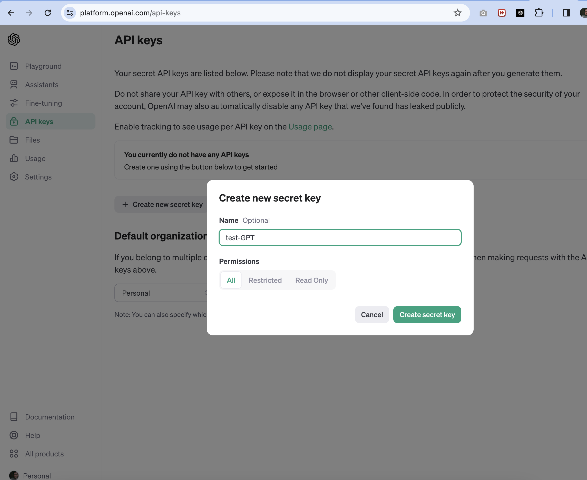
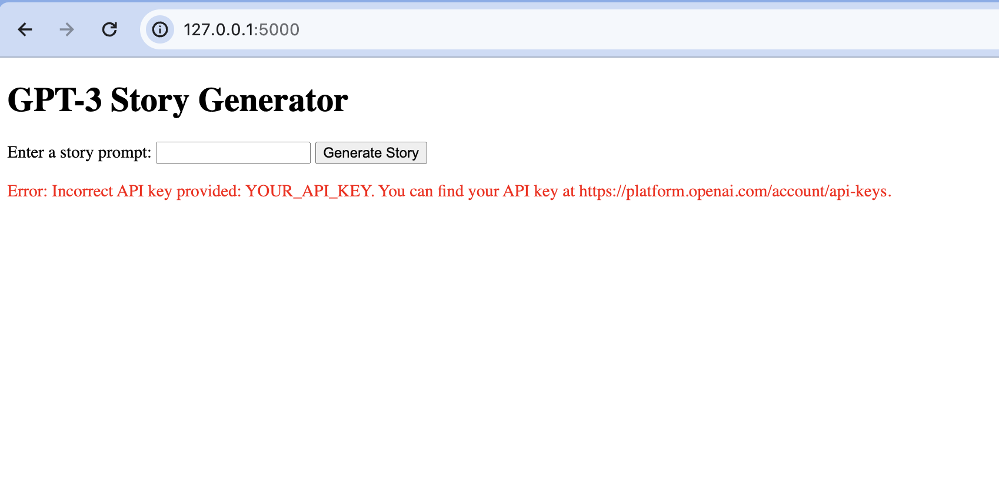
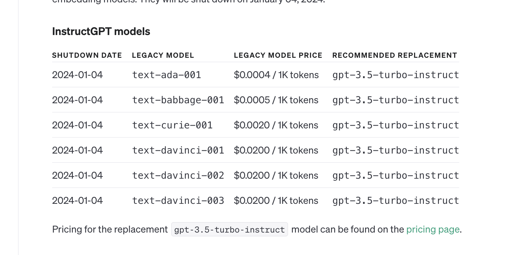
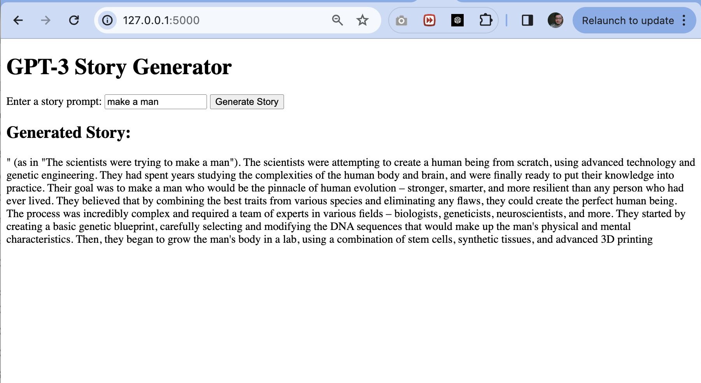
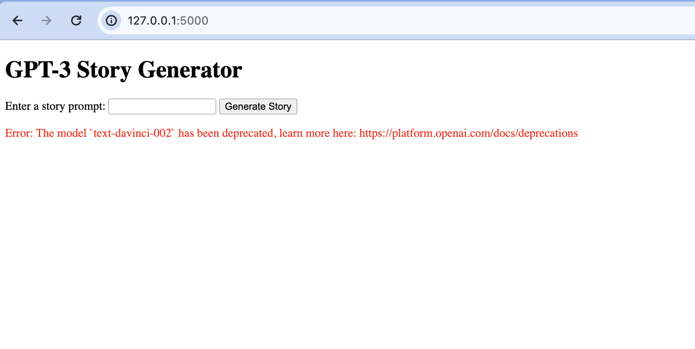

# GPT-3 Story Generator with Flask

This is a simple web application built with Flask that uses the OpenAI GPT-3 API to generate short stories based on user-provided prompts.

## Getting Started

### Prerequisites

- Python 3.x
- [OpenAI GPT-3 API Key](https://beta.openai.com/signup/)

### Installation

1. Clone the repository:

   ```bash
   git clone https://github.com/manish-jsx/py-openai.git
   ```

2. Navigate to the project directory:

   ```bash
   cd py-openai
   ```

3. Create and activate a virtual environment:

   ```bash
   python -m venv venv
   source venv/bin/activate  # On Windows: .\venv\Scripts\activate
   ```

4. Install dependencies:

   ```bash
   pip install -r requirements.txt
   ```

5. Create a `.env` file in the project root and add your GPT-3 API key:

   ```env
   OPENAI_API_KEY=your_actual_api_key
   ```

   Replace `your_actual_api_key` with your real OpenAI GPT-3 API key.

### Usage

1. Run the Flask application:

   ```bash
   python app.py
   ```

2. Open your web browser and visit [http://127.0.0.1:5000/](http://127.0.0.1:5000/).

3. Enter a story prompt and click "Generate Story" to see the GPT-3-generated story.

## Screenshots


*Description of Screenshot 1*


*Description of Screenshot 2*


*Description of Screenshot 3*


*Description of Screenshot 4*


*Description of Screenshot 5*